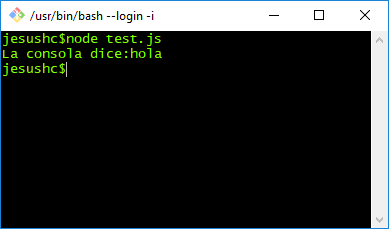
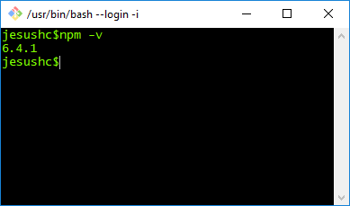
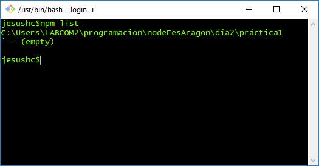
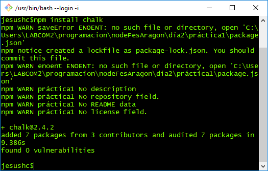
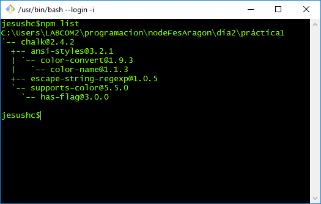
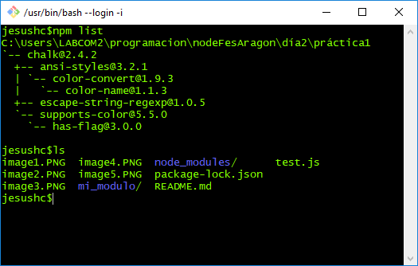
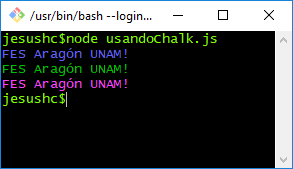
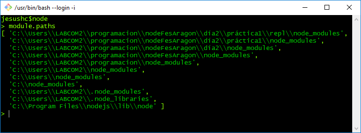

# Introducción a NPM #
NPM es el acrónimo de Node Package Manager, es el gestor de paquetes de Node.js y hoy en día además de ser el registro más grande de software, es uno de los más eficientes ya que además de simplificar a los desarrolladores la importación de código de terceros, revisa y resuelve dependencias entre bibliotecas de forma muy simple.

NPM incluye un Command Line Client (CLI) el cual es usado para gestionar los paquetes dentro del desarrollo de un proyecto. Antes de entrar de lleno al uso del CLI de NPM, revisemos la estructura de un paquete Node.js con un ejemplo.

Un paquete node es importado a un programa local con la sentencia:
      ```
      var chalk= require('chalk')
       ```

Por ejemplo, Chalk es un módulo escrito por un tercero que permite escribir mensajes en la consola con colores. De tal forma que si queremos usar Chalk, primero debemos instalarlo en nuestra computadora de desarrollo y una vez hecho, podemos importarla en nuestros programas.


También puedes importar un módulo escrito por ti; por ejemplo, en la carpeta mi_modulo de esta práctica se encuentra configurado un pequeño módulo que nos ayudará a ejemplificar. El código del archivo principal ``` index.js ``` es el siguiente:

```
exports.miConsoleLog=function(msg){
  console.log("La consola dice:"+msg);
}
 ```  

 y tenemos un programa de prueba ``` test.js ``` el cual tiene el siguiente código:

 ```
 var miconsola= require('./mi_modulo/index.js');

 miconsola.miConsoleLog("hola");

 ```

De esta forma podemos reutilizar código escrito previamente. Hay que notar que las funciones a usar por medio de *require* deben ser declaradas por medio de la sintaxis ``` exports ```.

1. Al ejecutar ``` $node test.js ``` obtenemos lo siguiente:



### importando paquetes publicados con NPM  ###

Si requerimos utilizar un paquete escrito por un tercero, podemos hacerlo vía la herramienta CLI de npm. Para verificar que tenemos la herramienta instalada ejecutamos ``` npm -v ```

2. Verificando la instalación de npm



Para revisar todos los paquetes instalados localmente ejecutamos ``` npm list ```:



Para instalar localmente el paquete Chalk requerimos hacer: ``` npm install chalk ```



Este comando descarga el paquete desde el repositorio general de node (npmjs.com) y lo instala localmente en tu directorio de tu programa. Por lo cual al volver ejecutar ``` npm list ``` debes tener el siguiente resultado:



El árbol mostrado a la salida, muestra todos los módulos instalados localmente. Todos los elementos bajo el nodo chalk@2.4.2 son las dependencias propias de Chalk.

Observa que al listar el contenido de tu carpeta se puede observar la creación de una carpeta nueva de nombre ``` node_modules ```




3. Escribe el programa usandoChalk.js y ejecutalo.

```
//usandoChalk.js
var chalk = require('chalk');
console.log(chalk.blue('FES Aragón UNAM!'));
console.log(chalk.green('FES Aragón UNAM!'));
console.log(chalk.purple('FES Aragón UNAM!'));

```



Para ver la documentación completa de [Chalk](https://www.npmjs.com/package/chalk).

[Aquí](https://www.npmjs.com/) puedes consultar los paquetes disponibles, con más de 960,000 de ellos; lo cuál lo hace el contenedor de bibliotecas de software más grande desde el 2017. Tan sólo en una semana puede tener 11 mil millones de descargas.

#### Ejercicio: ####
- Ingresa al [directorio](https://www.npmjs.com/) y consulta el paquete ``` request ``` e implementa un pequeño programa que consulte la página de [google](https://www.google.com)
- como segunda parte del ejercicio, realiza el request a la url: http://aragonapi.herokuapp.com/api/users
- Realiza el request de la dirección: http://aragonapi.herokuapp.com/api/users/1


### require y el directorio node_modules  ###

Cuando en un programa Node.js se invoca a la función *require*, se inicia un proceso de búsqueda en el directorio **node_modules**. En primera instancia busca en la carpeta del proyecto y en última instancia en la carpeta de instalación de Node.js.

Para desplegar el orden de búsqueda de los  paquetes, introduce el código: ``` module.paths ``` en el entorno REPL de node. El cuál es un arreglo que contiene las rutas absolutas de búsqueda de los paquetes.



Cuando se instala un módulo con ``` npm install [nombre_modulo] ``` se instala en el directorio actual.

Si se ejecuta el comando con el argumento -g, como a continuación ``` npm install -g [nombre_modulo] ``` el paquete se instala de forma general para que esté disponible desde cualquier directorio.

### instalar una versión específica ###

Para instalar una versión específica se emplea el operador ``` @ ``` con lo cual se establece indica la versión deseada. Por ejemplo:

La versión mas reciente del paquete *request* es la 2.88.0, pero si quisiéramos instalar localmente la versión 2.86.0 se debe ejecutar ``` npm install request@2.86.0  ```

El argumento *install* utiliza una semántica especial para determinar el número de versión a instalar, semántica que puede ser consultada [aquí](https://docs.npmjs.com/about-semantic-versioning)


### Algo mas de npm install ###

Generalmente los paquetes Node.js son de código abierto y disponibles en un repositorio git público, de tal forma que al instalar un paquete localmente lo más probable es que estés descargando el código desde **github.com**. También puedes instalar un paquete directamente de un repositorio git como en la documentación del CLI se observa:
```
npm install (with no args, in package dir)
npm install [<@scope>/]<name>
npm install [<@scope>/]<name>@<tag>
npm install [<@scope>/]<name>@<version>
npm install [<@scope>/]<name>@<version range>
npm install <git-host>:<git-user>/<repo-name>
npm install <git repo url>
npm install <tarball file>
npm install <tarball url>
npm install <folder>

aliases: npm i, npm add
```  

En la cual se pueden observar diferentes formas de instalar paquetes. En la siguiente práctica nos centramos en el uso de la primera opción:``` npm install sin argumentos. ```

### Como extra:

Para tener una terminal con fondo de algún pokemon como se muestra


Se detalla la instalación [aquí.](https://github.com/LazoCoder/Pokemon-Terminal)
